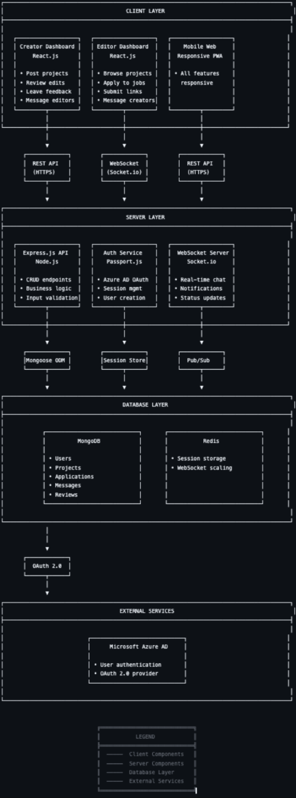
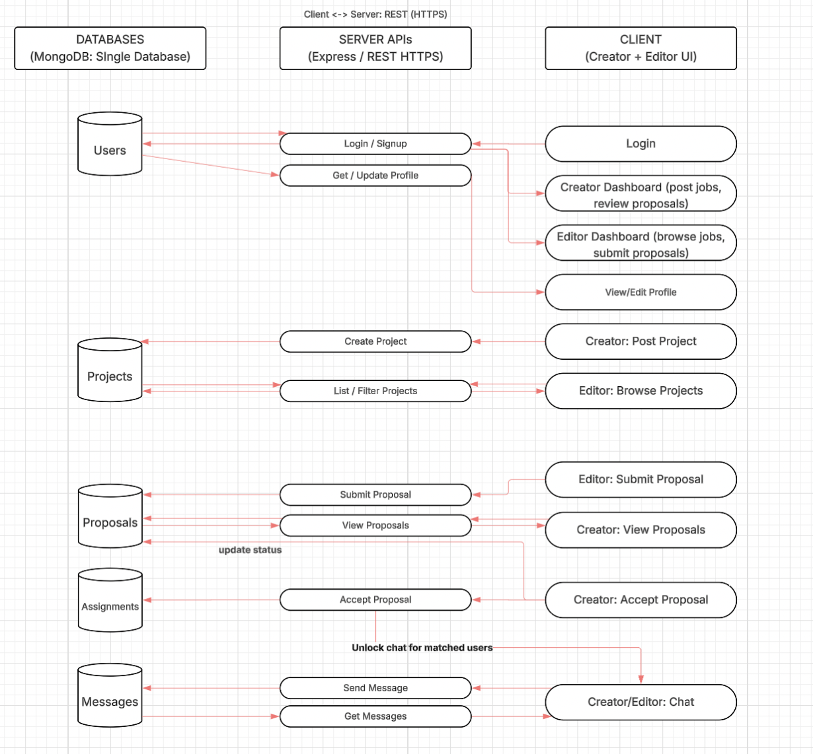
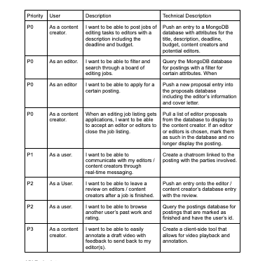
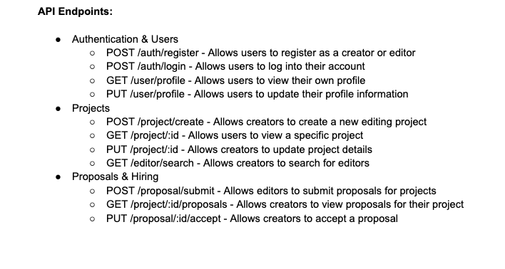
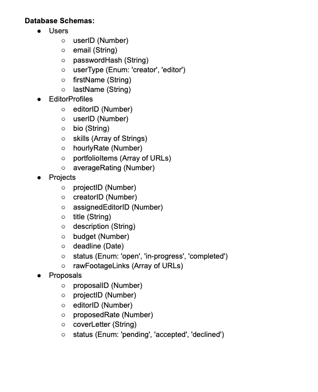

# Group 6's Final Project Proposal
INFO 441 Final Project proposal by group 6
By: Gurleen Samra, Keira Wong, Keira Wong, Mekias Kebede, Tony Wu

Link to MVP on render: https://info441-final-project-group6-1-client.onrender.com

Project Description:

Our app is a marketplace platform that connects content creators with video editors, built to address inefficiencies in how freelance editing work is currently found, managed, and completed. The primary audience for this application is content creators across various platforms, including YouTubers, TikTokers, Instagram creators, corporate social media managers, and small business owners who produce video content regularly but lack the time, skills, or resources to edit it themselves. While video editors represent an important user group on our platform, we're focusing our design decisions primarily on the creator experience, as they are the ones initiating projects and driving demand for editing services.
Content creators want to use our application because editing represents a significant bottleneck in their content production workflow. Many creators can film consistently but find that editing takes hours they don't have, or their self-edited content doesn't match the professional quality they envision for their brand. Existing solutions force creators to navigate fragmented workflows across multiple tools—posting jobs on general freelance platforms like Upwork or Fiverr, managing file transfers through Google Drive or Dropbox, communicating via email or separate messaging apps, and handling payments through different processors. This creates friction and wastes time that could be spent creating more content. Our platform consolidates the entire workflow into one seamless experience, from posting project requirements and uploading raw footage to reviewing edits with timestamped feedback and processing payments securely.
Unlike generalized freelance platforms that cover everything from graphic design to programming, our platform is hyper-focused specifically on video editing. This specialization allows us to build features tailored to the unique needs of video projects, such as cloud-based file management optimized for large video files, version control that lets creators see different iterations and provide precise feedback directly on a video player, and tiered pricing structures that match different project complexities. A simple TikTok compilation might cost fifteen to thirty dollars with a twenty-four hour turnaround, while a polished YouTube video with motion graphics and color grading could range from fifty to several hundred dollars. This pricing flexibility makes professional editing accessible to creators at various stages, from hobbyists testing the waters to established creators producing daily content.
We were drawn to this project because it addresses problems we've personally observed in our own communities. Many of our peers who create content for YouTube, TikTok, or Instagram struggle with the editing obstacle where they have strong ideas and can film consistently, but editing feels overwhelming or produces results that don't match their vision. Simultaneously, we know talented video editors in film programs or early in their careers who struggle to find steady freelance work because they lack industry connections or don't know how to market themselves effectively. Existing platforms don't adequately serve either group because they're not designed with the specific workflows of video production in mind. Building a focused marketplace that solves these pain points through thoughtful system design feels like a meaningful contribution to the creator economy, and it combines practical problem-solving with an interesting technical challenge. This is a platform we would realistically use ourselves as students interested in content creation who understand both the value of high-quality edited content and the challenge of producing it consistently.

Architectural Diagram:

Data Flow:

User Stories:

API Endpoints:

Database Schemas:

